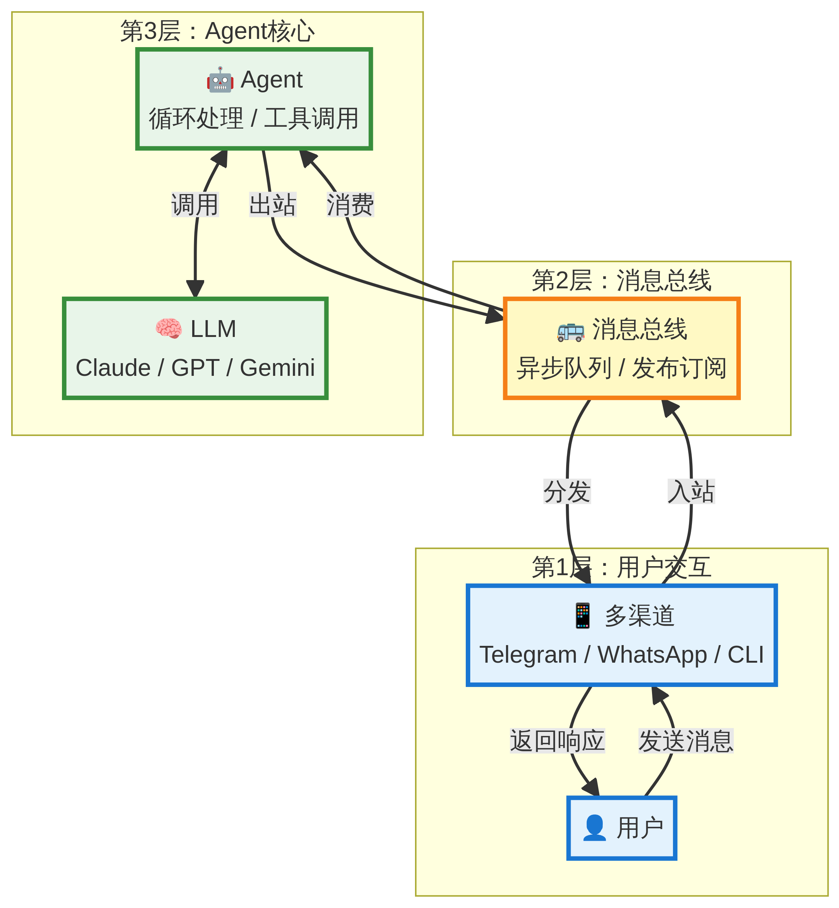
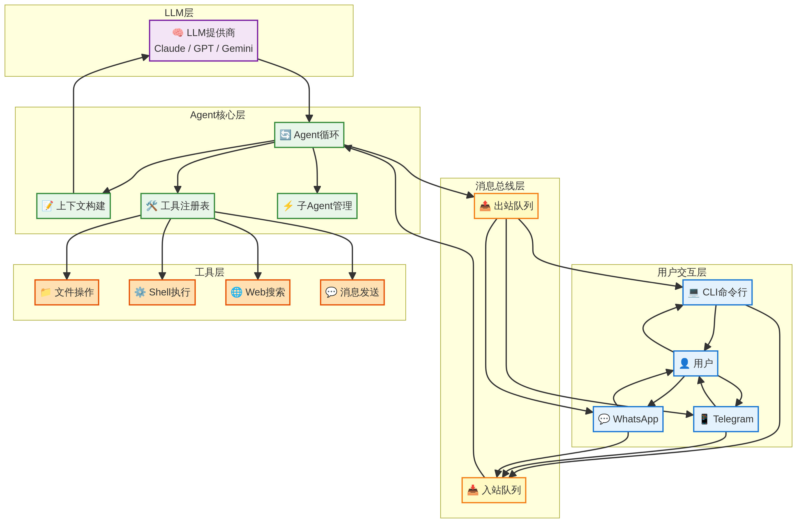
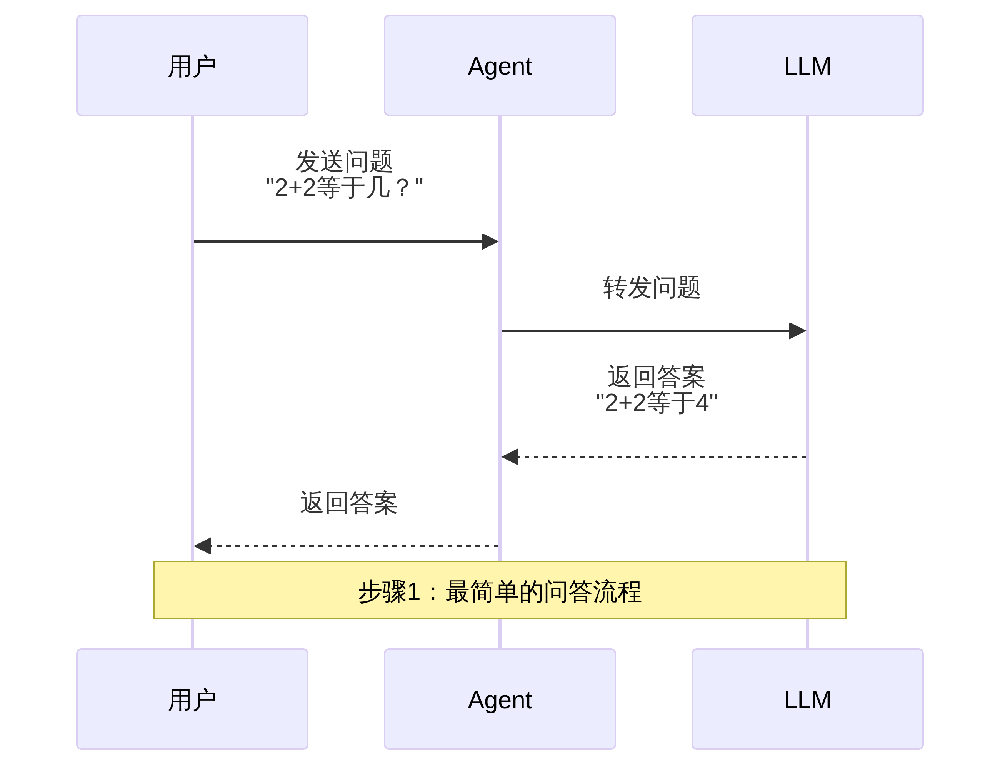
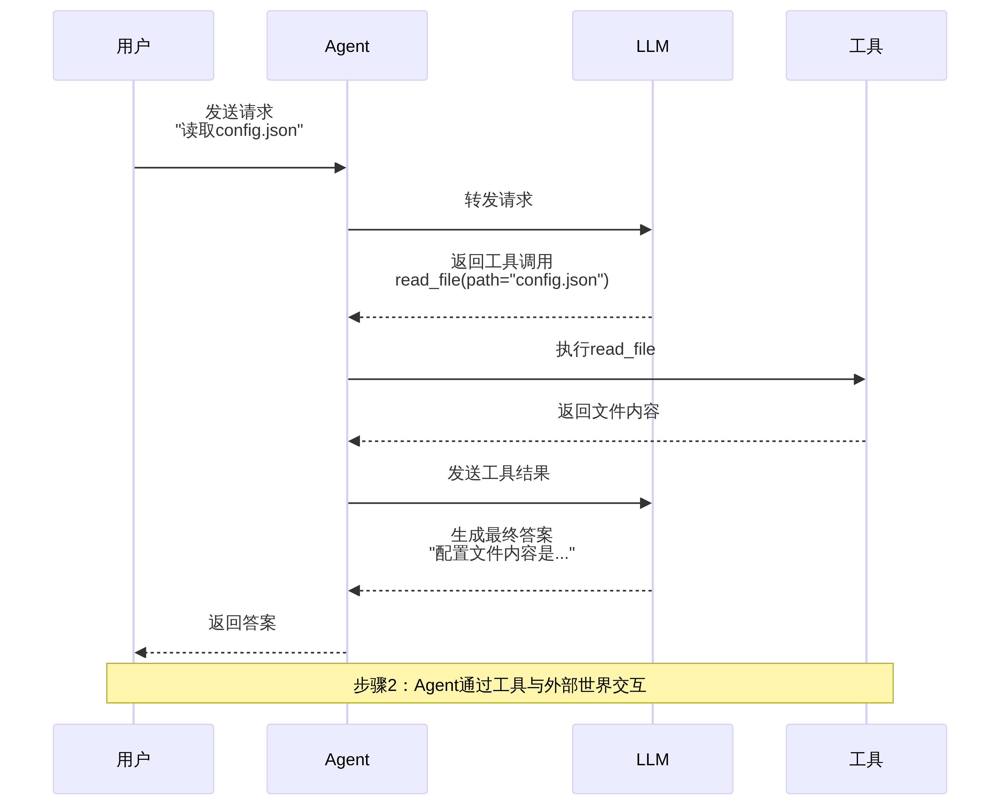
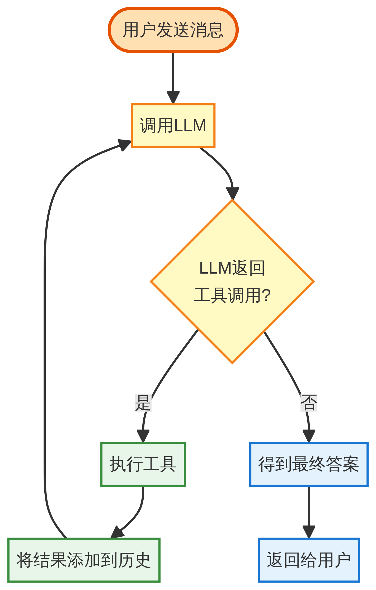
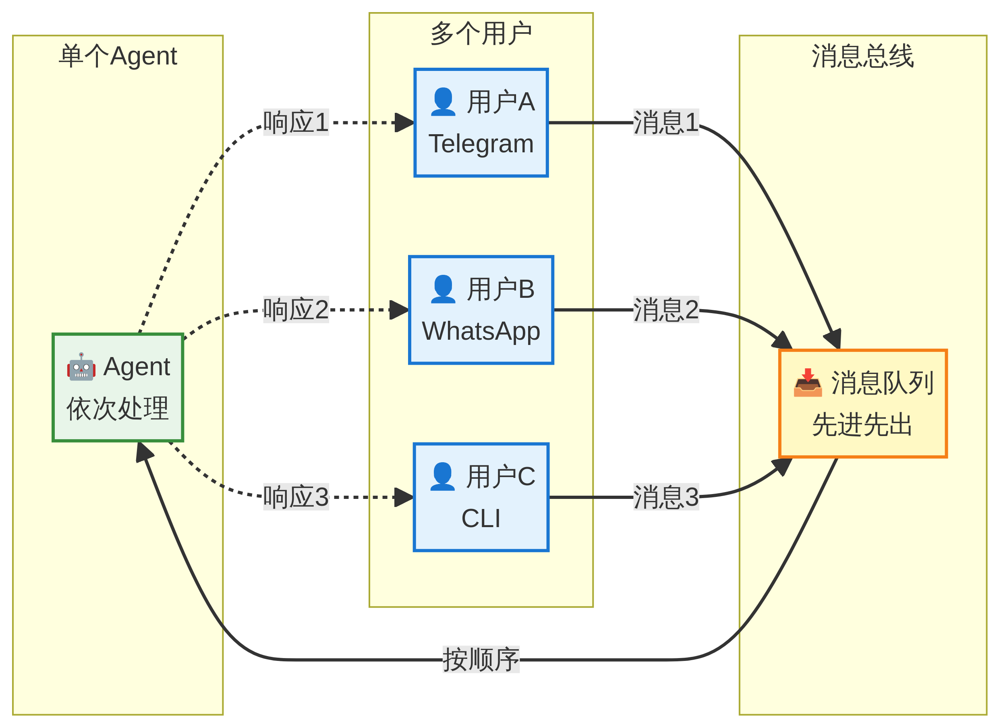
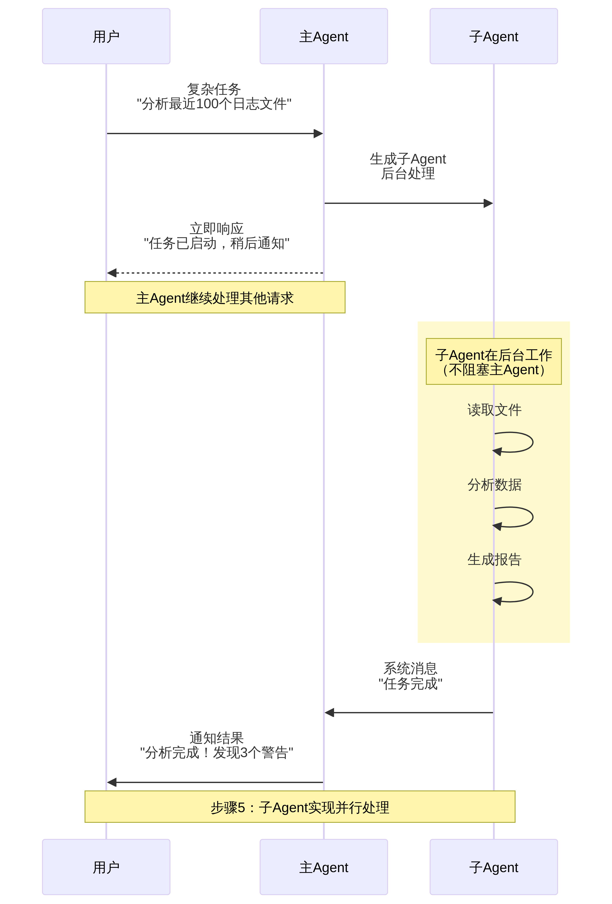

# nanobot: 超轻量级个人AI助手 (中文学习版)

<div align="center">
  
  <h1>nanobot: 超轻量级个人AI助手</h1>
  <p>
    <a href="https://pypi.org/project/nanobot-ai/"></a>
    <a href="https://pepy.tech/project/nanobot-ai"></a>
    
    
    <a href="./COMMUNICATION.md"></a>
    <a href="./COMMUNICATION.md"></a>
    <a href="https://discord.gg/MnCvHqpUGB"></a>
  </p>
</div>

---

🐈 **nanobot** 是一个**超轻量级**的个人AI助手框架，灵感来源于 [Clawdbot](https://github.com/openclaw/openclaw)。

⚡️ 仅用 **~5,000行** Python代码实现了完整的Agent核心功能，比Clawdbot的43万多行代码**小99%**。

这个版本是在原项目基础上添加了**详细的中文注释**和**由浅入深的架构图**，旨在帮助开发者更好地学习和理解AI Agent的实现原理。

## 核心特性

- 🪶 **超轻量**: 仅约5000行代码，易于学习和修改。
- 🔬 **研究友好**: 干净、可读的代码，是AI Agent研究的理想起点。
- ⚡️ **闪电启动**: 极小的代码体积意味着更快的启动速度和更低的资源占用。
- 💎 **易于使用**: 一键安装，快速上手。
- 🧩 **模块化设计**: 清晰的架构分层，各模块职责明确。
- 🔌 **可扩展**: 支持自定义工具、技能和渠道。

## 🏗️ 架构：由浅入深

nanobot采用分层、模块化的设计，核心组件之间通过消息总线解耦，具有高度的灵活性和可扩展性。

### 1. 宏观三层架构

从最高层面看，nanobot可以分为三个核心层次：

<p align="center">
  
</p>

| 层次 | 主要职责 |
| :--- | :--- |
| **用户交互层** | 负责与用户通过不同渠道（CLI、Telegram、WhatsApp）进行交互。 |
| **消息总线层** | 异步消息队列，解耦渠道和Agent核心，实现发布-订阅模式。 |
| **Agent核心层** | 实现Agent的核心逻辑，包括主循环、工具调用和LLM交互。 |

### 2. 详细组件架构

展开Agent核心层，我们可以看到更详细的组件关系：

<p align="center">
  
</p>

## 核心流程：由浅入深

理解nanobot的最佳方式是跟随它的核心流程，从最简单的问答到复杂的并行处理。

### 步骤1：最简单的问答流程

当用户提出一个不需要工具的简单问题时，流程非常直接：

<p align="center">
  
</p>

### 步骤2：引入工具调用

当需要与外部世界交互时（如读文件、上网），Agent会使用工具：

<p align="center">
  
</p>

### 步骤3：Agent循环机制

为了完成可能需要多次工具调用的复杂任务，Agent会进入一个循环：

<p align="center">
  
</p>

### 步骤4：支持多渠道

通过消息总线，单个Agent可以同时为来自不同渠道的多个用户服务：

<p align="center">
  
</p>

### 步骤5：子Agent并行处理

对于耗时或复杂的任务，主Agent可以生成一个子Agent在后台处理，而不会阻塞自己：

<p align="center">
  
</p>

## 📦 安装

**从源码安装** (推荐，可查看中文注释)

```bash
git clone https://github.com/Carlehyy/nanobot.git
cd nanobot
# 切换到中文注释分支
git checkout study 
pip install -e .
```

**使用 [uv](https://github.com/astral-sh/uv) 安装** (稳定、快速)

```bash
uv tool install nanobot-ai
```

**从 PyPI 安装** (稳定版)

```bash
pip install nanobot-ai
```

## 🚀 快速开始

> [!TIP]
> 在 `~/.nanobot/config.json` 中设置你的API密钥。
> 获取API密钥: [OpenRouter](https://openrouter.ai/keys) (LLM) · [Brave Search](https://brave.com/search/api/) (可选, 用于Web搜索)
> 你也可以将模型更改为 `minimax/minimax-m2` 以降低成本。

**1. 初始化**

```bash
nanobot onboard
```

**2. 配置** (`~/.nanobot/config.json`)

```json
{
  "providers": {
    "openrouter": {
      "apiKey": "sk-or-v1-xxx"
    }
  },
  "agents": {
    "defaults": {
      "model": "anthropic/claude-opus-4-5"
    }
  },
  "tools": {
    "web": {
      "search": {
        "apiKey": "BSA-xxx"
      }
    }
  }
}
```

**3. 对话**

```bash
nanobot agent -m "2+2等于几？"
```

就是这样！你在2分钟内拥有了一个可工作的AI助手。

## 🤝 贡献 & 路线图

欢迎提交PR！代码库被有意设计得小而可读。🤗

**路线图** — 选择一个任务并[提交PR](https://github.com/Carlehyy/nanobot/pulls)！

- [x] **语音转录** — 支持Groq Whisper (Issue #13)
- [ ] **多模态** — 能看能听（图片、语音、视频）
- [ ] **长期记忆** — 永不忘记重要上下文
- [ ] **更好的推理** — 多步规划和反思
- [ ] **更多集成** — Discord、Slack、邮件、日历
- [ ] **自我提升** — 从反馈和错误中学习

## ⭐ Star历史

<div align="center">
  <a href="https://star-history.com/#HKUDS/nanobot&Date">
    <picture>
      <source media="(prefers-color-scheme: dark)" srcset="https://api.star-history.com/svg?repos=HKUDS/nanobot&type=Date&theme=dark" />
      <source media="(prefers-color-scheme: light)" srcset="https://api.star-history.com/svg?repos=HKUDS/nanobot&type=Date" />
      
    </picture>
  </a>
</div>

<p align="center">
  <em>感谢访问 ✨ nanobot!</em><br><br>
  
</p>

<p align="center">
  <sub>nanobot仅用于教育、研究和技术交流目的</sub>
</p>
